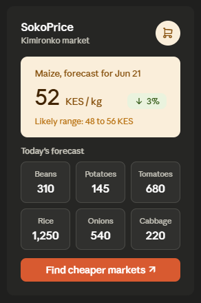
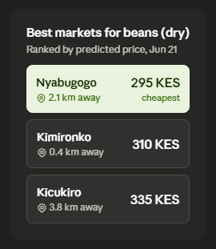
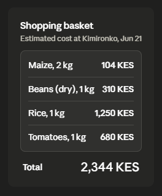
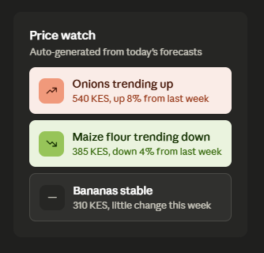

# SokoPrice

AI grocery price forecasting for Kigali informal markets.
BSc Software Engineering
Author: Nice Eva Karabaranga | Supervisor: Hubert Apana


## Description

SokoPrice predicts short-term grocery prices for informal markets in Kigali and recommends the cheapest market for a given commodity. It targets thirteen staples commonly sold in Kigali markets: maize, maize flour, potatoes, rice, beans (dry and yellow), sorghum, onions, tomatoes, cabbage, flour, bananas, and spinach.

The current prototype uses the WFP VAM Kenya food price dataset as proxy data, since real-time Kigali price data was not available within the project timeline. Kenya and Rwanda share similar informal market structures and staple food baskets, so the pipeline built here is expected to transfer well once retrained on real Kigali data.

## Project structure

```
Initial-software-product/
├── Data/
│   └── wfp_food_prices_ken.csv
├── models/
│   ├── model_lgbm.pkl
├── scaler/
│   ├── scaler_X.pkl
│   └── scaler_y.pkl
├── designs/
│   ├── home.png
│   ├── recommendations.png
│   ├── basket.png
│   └── price_watch.png
├── main.py
├── notebook
|   └──SokoPrice-model-training.ipynb
├── requirements.txt
└── README.md
```

## Environment setup

```bash
git clone https://github.com/niceevakarabaranga/Initial-software-product
cd Initial-software-product

python -m venv venv
source venv/bin/activate or venv\Scripts\activate

pip install -r requirements.txt

uvicorn main:app --reload
```

Swagger UI: `http://127.0.0.1:8000/docs`

## Running the notebook

Open `SokoPrice_Capstone_Notebook.ipynb` on Kaggle with GPU enabled. Run the Phase 0 cell first, restart the session, then run all remaining cells in order.

## API overview

| Method | Endpoint | Purpose |
|---|---|---|
| GET | `/` | Health check |
| GET | `/commodities` | List supported commodities |
| GET | `/markets` | List supported markets |
| POST | `/predict` | 7-day price forecast |
| POST | `/recommend` | Cheapest market for a commodity |
| POST | `/basket` | Shopping basket cost estimate |
| GET | `/alerts/{commodity}` | Price threshold check |

Supported markets: Kimironko, Nyabugogo, Kicukiro.

## Designs

App interface mockups, built as an HTML prototype.

| Home and forecast | Market recommendations |
|:---:|:---:|
  | |
| Shopping basket | Price watch |
|:---:|:---:|
  |  |

The home screen shows the forecast for a selected commodity plus a daily price grid. The recommendations screen ranks markets by predicted price for a chosen commodity. The basket screen totals the cost of a multi-item shopping list. The price watch screen is a planned feature showing week-over-week price movement; it is not yet wired to the `/alerts` endpoint, which currently checks price against a fixed threshold instead.

## Model comparison

All models were trained on 17 engineered features (price lags, rolling statistics, cyclical month encoding, commodity and market encodings) using an 80/20 temporal split to avoid data leakage. Primary metric is MAPE.

| Model | Type | Key parameters | MAE (KES) | RMSE (KES) | R² | MAPE (%) |
|---|---|---|---|---|---|---|
| LightGBM | Boosting ensemble | n_estimators=500, lr=0.05, num_leaves=63, subsample=0.8 | 35.602 | 224.982 | 0.9916 | 9.03 |
| XGBoost | Boosting ensemble | n_estimators=500, lr=0.05, max_depth=6, subsample=0.8 | 47.334 | 212.692 | 0.9925 | 14.23 |
| Random Forest | Bagging ensemble | n_estimators=300, max_features=sqrt, min_samples_split=5 | 79.965 | 385.172 | 0.9755 | 14.24 |
| Linear Regression | Parametric baseline | 17 coefficients, OLS | 172.620 | 558.281 | 0.9485 | 80.87 |
| SVR | Kernel method | kernel=rbf, C=100, gamma=0.01, epsilon=0.01 | 181.912 | 521.285 | 0.9551 | 94.48 |
| LSTM | Deep learning | LSTM(128)→LSTM(64)→Dense(32)→Dense(1), Adam lr=0.001 | 2104.138 | 2707.327 | -0.2117 | 2715.74 |
| GRU | Deep learning | GRU(128)→GRU(64)→Dense(32)→Dense(1), Adam lr=0.001 | 2100.442 | 2671.393 | -0.1798 | 2724.03 |

Best model: LightGBM, with MAPE 9.03%, R² 0.9916, MAE 35.602 KES, RMSE 224.982 KES. This is a 71.84% MAPE improvement over the Linear Regression baseline. LightGBM is the model currently wired into `main.py`.

The LSTM and GRU results are worth flagging rather than hiding. Both deep learning models produced MAPE values above 2700%, far worse than every other model including the baseline. This points to a scaling or sequence-construction issue specific to the recurrent models rather than a genuine architecture failure, and is discussed further below.

## Errors encountered and fixes

| Issue | Cause | Fix |
|---|---|---|
| `pip` dependency conflict warnings on install | Kaggle's pre-installed packages have version mismatches with fresh installs | Ignored; warnings only, not blocking errors |
| `AttributeError: module numpy has no attribute _no_nep50_warning` | scipy/seaborn versions incompatible with Kaggle's numpy 2.x | Upgraded scipy and seaborn with `--no-deps`, restarted kernel |
| `TypeError: Cannot convert ... to numeric` on `groupby().median()` | Price column auto-detection matched `pricetype` (text column) instead of the numeric price column | Filtered candidate columns with `select_dtypes(include='number')` before matching on name |
| `FileNotFoundError` loading the CSV | Kaggle dataset path did not match the hardcoded path | Cloned dataset via GitHub repo into `/kaggle/working/`, added a fallback search across `/kaggle` |

## Points to note for future work on real Kigali data

Data collection should record price, date, market, and commodity at minimum, in a consistent format from the start. Column naming inconsistencies cost significant debugging time on the proxy dataset and will repeat if not standardised early.

Seasonal patterns learned from Kenya data may not transfer directly. Kigali's harvest calendar, transport routes, and import dependencies differ from Kenya's, so the seasonal index and lag features should be re-validated once real data is available, not assumed to carry over.

The 80/20 temporal split worked well here because the dataset spans many years. Real Kigali data collected over a shorter period will need a different split strategy, possibly cross-validation with smaller folds, to avoid training on too little history.

LightGBM was selected as the production model in `main.py`, but the notebook benchmarks seven models. On real Kigali data re-running the full comparison is crucial rather than assuming LightGBM remains best, since model rankings can change with a different data distribution.

Directional accuracy (percentage of correct up/down predictions) is a useful supplementary metric alongside MAE, RMSE, R², and MAPE, since it is easier to communicate to non-technical stakeholders like market vendors.

## Deployment plan

| Layer | Technology | Notes |
|---|---|---|
| ML model | LightGBM | Currently active in `main.py` |
| Backend API | FastAPI | Swagger UI at `/docs` |
| Frontend | Streamlit or the HTML mockup | Not yet built |
| Database | SQLite for prototype | Move to PostgreSQL for production |
| Hosting | Railway.app | Free, supports FastAPI and Postgres |